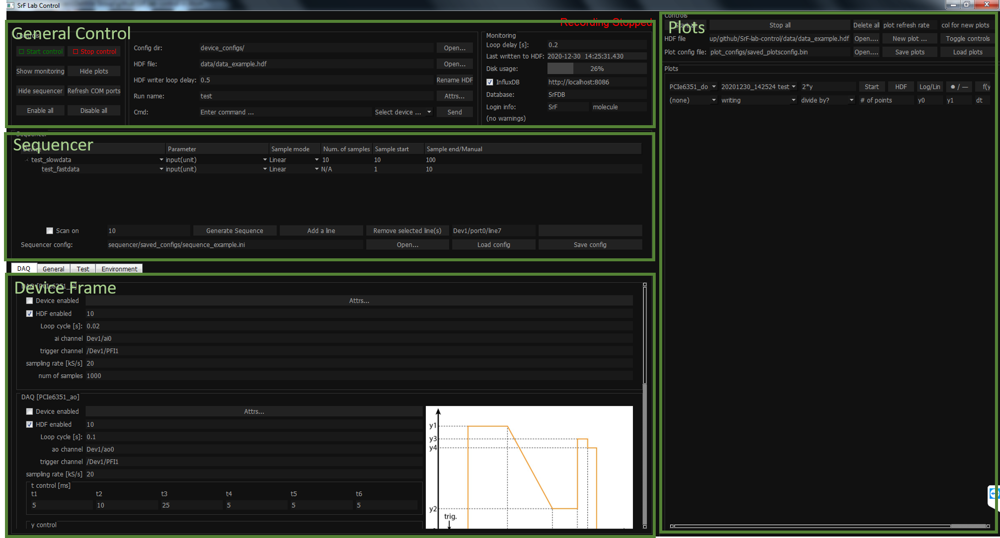

# SrF-Lab-Control

This is a generic program designed to interface with multiple devices at the same time. The program coordinates with different modules — device threads, Monitor, HDF Writer, Plotter, Sequencer, etc — to meet data acquiring needs in atomic, molecular and optical (AMO) physics experiments.

A device can be imported to this program by adding a configuration file (.ini) to `device_configs/` directory and a driver file (.py) to `drivers/` directory. Those files will be read by the program automatically. See `examples/device_config_example.ini` and `examples/device_driver_example.py` for examples.

The original repository [CeNTREX](https://github.com/js216/CeNTREX) has included an elaborate document, so here I only focus on the Sequencer, which is not mentioned there and also looks quite different in this version of program.

## Sequencer

In Sequencer
