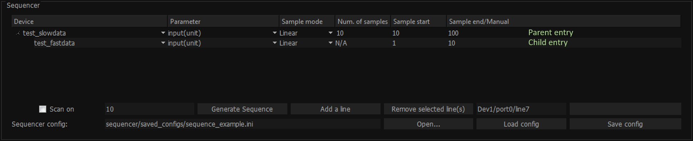

# SrF-Lab-Control

This is a generic program designed to interface with multiple devices at the same time. The program coordinates with different modules — device threads, _Monitor_, _HDF Writer_, _Plotter_, _Sequencer_, etc — to meet data acquiring needs in atomic, molecular and optical (AMO) physics experiments.

A device can be imported to this program by adding a configuration file (.ini) to `device_configs/` directory and a driver file (.py) to `drivers/` directory. Those files will be read by the program automatically. See `examples/device_config_example.ini` and `examples/device_driver_example.py` for examples.

The original repository [CeNTREX](https://github.com/js216/CeNTREX) has included an elaborate document, so here I only focus on the _Sequencer_, which is not mentioned there and also looks quite different in this version of program.

## Sequencer

_Sequencer_ can scan device parameters by loading different values of the scanned parameters into devices in every experimental cycle.

In _Sequencer_ tree widget, indented entries are treated as child entries. Child devices are scanned synchronously with the parent device. Namely although the scanning sequence will be randomized, when the parent device has a certain value, child devices always have the corresponding values at that moment. It can be useful sometimes, for example, when we scan RF frequency of an AOM to scan laser frequency, we may want to synchronously scan RF power to keep laser intensity a constant.  _Num. of samples_ can only be set in the parent device entry, and child devices will use the same value.

Multiple parent devices can be scanned Uncorrelatedly at the same time (instead of sequentially), and each parent device can have multiple child devices.

One of the biggest challenges here is that to synchronize device parameter loading with experimental cycles. There are two types of devices, those that can block their threads until recording finishes (e.g. NI DAQ with wait_until_done() function called) and those can't (e.g. Novatech DDS). This property needs to be specified in device configuration files. For the first type, we assume that they are triggered by external TTL's so they are synchronized with the experimental cycles and only run once in each cycle. So we can just load new parameters into them once their run finishes. For the second type, we need an additional NI DAQ being triggered externally to tell the program about experimental cycle timing and when to load parameters.

